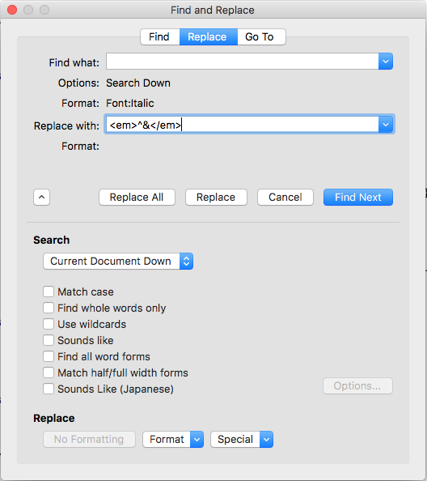
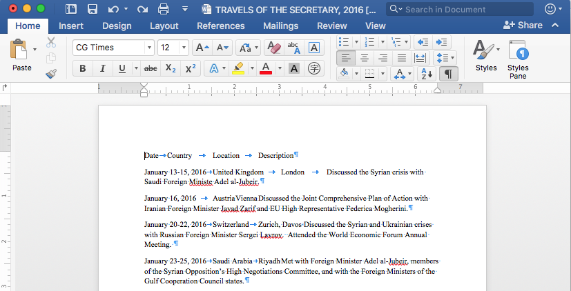
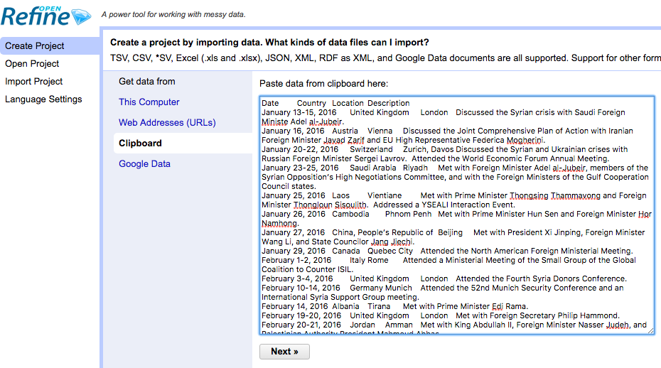
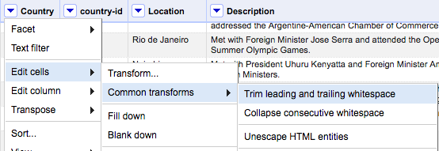
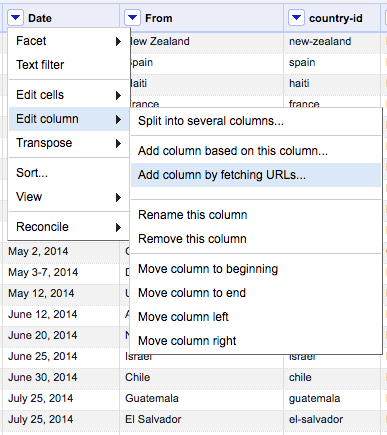
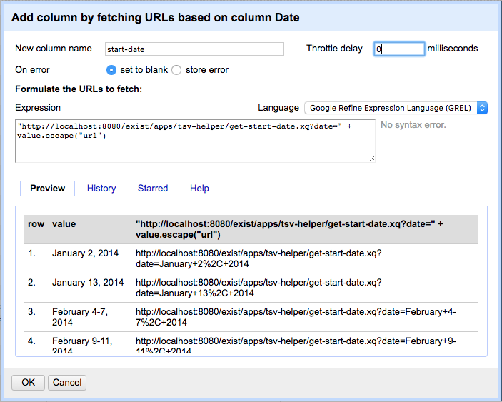
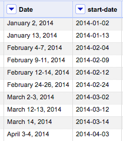
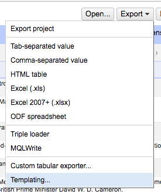

# Preparing Travels and Visits

These directions explain how to take a submission from Evan Duncan with the latest entries from Travels of the President, Travels of the Secretary of State, or Visitors by Foreign Leaders, and convert them into the format needed for display on hsg. 

## Prerequisites

These directions assume you have a fully up-to-date [hsg-project system](setup) with your eXist database populated with hsg-project, as well as the current versions oXygen XML Editor, OpenRefine, GitHub Desktop, and Microsoft Office.

## Prepare the MS Word File

1. Open Evan Duncan's submission in MS Word
1. Delete all text before the start of the table, so the entire document is just the table
1. Use Advanced Find and Replace to turn any italicized text into `<em>^&</em>`
    
1. Select all, copy, and paste
1. Click on the floating menu and select "Keep Text Only," so only text is left, and the table is gone
1. Select the "show editing marks" icon in the Word toolbar, to show tabs and returns. Delete any extra returns and extra copies of column headings (sometimes Evan included extra column headings at the top of pages). Keep the top column heading. Review the document for any unexpected formatting (entries split by a return, extra tabs, etc.). 
1. This is your TSV (tab-separated value) file. Paste it into a new oXygen file, and scan again for irregularities.
    

## Prepare the "enrich" app

Install the [enrich](https://github.com/joewiz/enrich) app.

## Enrich the data in OpenRefine

1. In OpenRefine, select Create Project > Clipboard, and paste the TSV file into the text field
1. Review the preview to ensure all looks as expected, give the project a name, then select the Create Project button to the upper-right of the text field
    
1. Advance through the rows to make sure the import completed as expected
1. For each of the following fields, select Edit Cells > Common Transforms > Trim leading and trailing whitespace, then select Edit Column > Add column by fetching URLs, setting Throttle Delay to 0 for all:

    
    
    

    - Country:
    
        - New column name: `country-id`
        
        - Expression: `"http://localhost:8080/exist/apps/enrich/modules/get-country.xq?country=" + value.escape("url")`
      
    - Date (1st pass for end date):
    
        - New column name: `end-date`
        
        - Expression: `"http://localhost:8080/exist/apps/enrich/modules/get-end-date.xq?date=" + value.escape("url")`

    - Date (2nd pass for start date):
    
        - New column name: `start-date`
        
        - Expression: `"http://localhost:8080/exist/apps/enrich/modules/get-start-date.xq?date=" + value.escape("url")`

1. Check the resulting columns for any irregularities, such as blank cells where there should be a date or country ID. Enter values for these fields, correcting the field as appropriate.

    
    
## Export from OpenRefine

1. Select Export > Templating, and use the following values for the different projects, substituting the values as noted, and making sure the column names in `{{cells["column-name"].value}}` line up with the column names in your project (otherwise values in those elements will come out as `null`).

    

    - Travels of the President
    
        - Prefix:
        
            ```xml
            <trips>
            
            ```
            
            (That is, `<trips>` with a return.)

        
        - Row Template:
        
            ```xml
                <trip who="obama-barack" role="president">
                    <id/>
                    <role>president</role>
                    <name>Barack Obama</name>
                    <start-date>{{cells["start-date"].value}}</start-date>
                    <end-date>{{cells["end-date"].value}}</end-date>
                    <country id="{{cells["country-id"].value}}">{{cells["Country"].value}}</country>
                    <locale>{{cells["Location"].value}}</locale>
                    <remarks>{{cells["Remarks"].value}}</remarks>
                    <created-by>wicentowskijc</created-by>
                    <created-datetime>2017-04-21T14:29:13.672-04:00</created-datetime>
                    <last-modified-by>wicentowskijc</last-modified-by>
                    <last-modified-datetime>2017-04-21T14:29:13.672-04:00</last-modified-datetime>
                </trip>
            ```
        
            (Substitute the President's name and ID, your username, and date stamp.)
        
        - Row Separator:
        
            ```
            
            ```

            (That is, a blank line with a return.)            
        
        - Suffix:
        
            ```xml
            
            </trips>
            ```
            
            (That is, `<trips>` with a return.)            
    
    - Travels of the Secretary of State
    
        - Prefix:
        
            ```xml
            <trips>
            
            ```
            
            (That is, `<trips>` with a return.)
        
        - Row Template:
        
            ```xml
                <trip who="kerry-john-forbes" role="president">
                    <id/>
                    <role>secretary</role>
                    <name>John Forbes Kerry</name>
                    <start-date>{{cells["start-date"].value}}</start-date>
                    <end-date>{{cells["end-date"].value}}</end-date>
                    <country id="{{cells["country-id"].value}}">{{cells["Country"].value}}</country>
                    <locale>{{cells["Location"].value}}</locale>
                    <remarks>{{cells["Remarks"].value}}</remarks>
                    <created-by>wicentowskijc</created-by>
                    <created-datetime>2017-04-21T14:29:13.672-04:00</created-datetime>
                    <last-modified-by>wicentowskijc</last-modified-by>
                    <last-modified-datetime>2017-04-21T14:29:13.672-04:00</last-modified-datetime>
                </trip>
            ```
        
            (Substitute the Secretary's name and ID, your username, and date stamp.)
        
        - Row Separator:
        
            ```
            
            ```
            
            (That is, a blank line with a return.)
            
        - Suffix:
        
            ```xml
            
            </trips>
            ```
            
            (That is, a return with `</trips>`.)
    
    - Visits of Foreign Leaders
    
    
        - Prefix:
        
            ```xml
            <visits>
            
            ```
            
            (That is, `<visits>` with a return.)
        
        - Row Template:
        
            ```xml
                <visit>
                    <id/>
                    <start-date>{{cells["start-date"].value}}</start-date>
                    <end-date>{{cells["end-date"].value}}</end-date>
                    <visitor>{{cells["Visitor"].value}}</visitor>
                    <from id="{{cells["country-id"].value}}">{{cells["Country"].value}}</from>
                    <description>{{cells["Description"].value}}</description>
                    <created-by>wicentowskijc</created-by>
                    <created-datetime>2017-04-21T14:29:13.672-04:00</created-datetime>
                    <last-modified-by>wicentowskijc</last-modified-by>
                    <last-modified-datetime>2017-04-21T14:29:13.672-04:00</last-modified-datetime>
                </visit>
            ```
        
        - Row Separator:
        
            ```
            
            ```
            
            (That is, a blank line with a return.)
            
        - Suffix:
        
            ```xml
            
            </visits>
            ```
            
            (That is, a return with `</visits>`.)

1. Look over the preview to make sure that everything looks good, and that no elements contain `null` (indicating that the cell column wasn't properly selected)
1. Select the Export button
1. OpenRefine will download a new file to your desktop, with the `.txt` file extension
1. Change the file extension from `.txt` to `.xml`
1. Open the file in oXygen and check for any irregularities

## Add IDs in eXist, preview, and publish

1. Drag the `.xml` file into a new eXide tab
1. Save it into the appropriate folder in eXist as a temporary file, e.g., `/db/kerry-john-forbes-2016.xml`
1. Run the following query to add IDs, editing the filename as appropriate

    - Travels of the President
    
        ```xquery
        xquery version "3.1";
        
        let $start := max((collection('/db/apps/travels/president-travels')//id[. ne ''], collection('/db/apps/travels/secretary-travels')//id[. ne '']))
        for $trip at $count in doc('/db/temp/obama-barack-2016.xml')//trip
        let $id := update value $trip/id with $start + $count
        return $trip
        ```
    
    - Travels of the Secretary of State
    
        ```xquery
        xquery version "3.1";
        
        let $start := max((collection('/db/apps/travels/president-travels')//id[. ne ''], collection('/db/apps/travels/secretary-travels')//id[. ne '']))
        for $trip at $count in doc('/db/temp/kerry-john-forbes-2016.xml')//trip
        let $id := update value $trip/id with $start + $count
        return $trip
        ```
    
    - Visits of Foreign Leaders
    
        ```xquery
        xquery version "3.1";
        
        let $start := max(collection('/db/apps/visits/data')//id[. ne ''])
        for $visit at $count in doc('/db/temp/2010-new.xml')//visit
        let $id := update value $visit/id with $start + $count
        return $visit
        ```

1. Open the resulting temporary document and copy/paste all but the root element of the document into the destination file
1. Upload the file to localhost and preview the results
1. When the file is confirmed to look good, upload it to hsg and confirm all looks good
1. Commit the file to GitHub